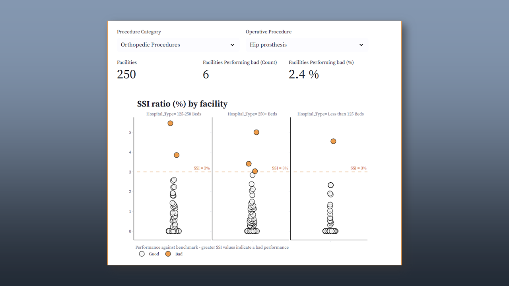

# Surgical Site Infections (SSI) in Community Hospitals from CA, USA

Data from 262 community hospitalar facilites in 2017.

  

**SSI** are those infections that occurs after a surgical procedure and can result in:   
**1.** Additional costs to the hospital,  **2.** Longer patient staying time, 
**3.** Unexpected readimissions,  **4.** Deaths.  Thus, preventing or reducing SSI plays 
a great role in healthcare facilities.   Considering a **benchmark of 3\%** for **SSI**,
could you quickly get those facilities performing bad (SSI > benchmark)? 

With this *Streamlit app* you could do that by procedure category and procedure type.

TLDR:

- **Original data**: [Kaggle](https://www.kaggle.com/datasets/aimlanalytics/surgicalsiteinfectionsssishealthcare)
- **Data Cleaning**: [GitHub Folder](https://github.com/OviedoVR/SSI_Community_Hospitals_CA/tree/main/data_cleaning)
- **Streamlit app**:
