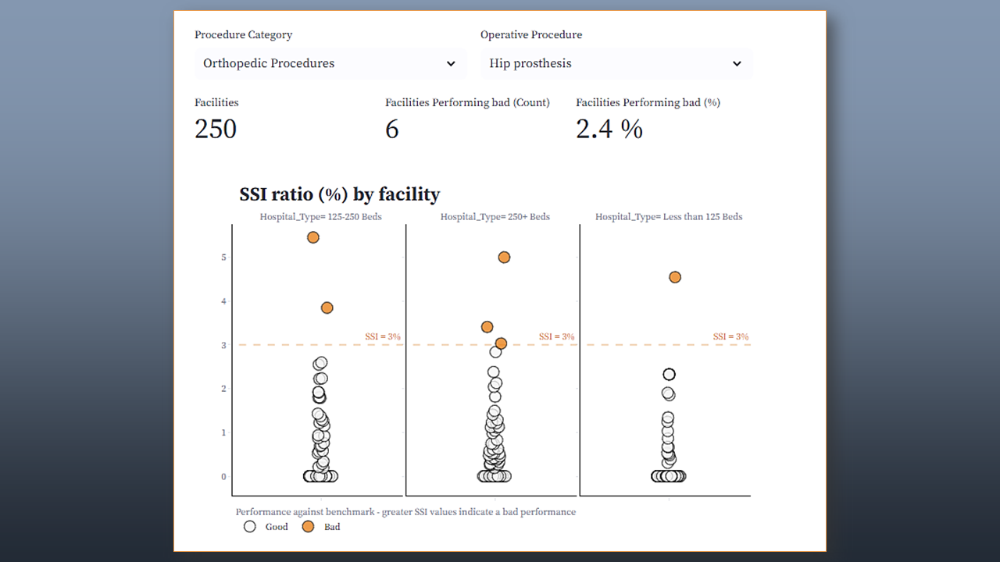

# Surgical Site Infections (SSI) in Community Hospitals from CA, USA

Data from 262 community hospitalar facilites in 2017.

- **Original data**: [Kaggle](https://www.kaggle.com/datasets/aimlanalytics/surgicalsiteinfectionsssishealthcare)
- **Data Cleaning**: https://github.com/OviedoVR/SSI_Community_Hospitals_CA/tree/main/data_cleaning
- **Streamlit app**:
  
 

 
  

